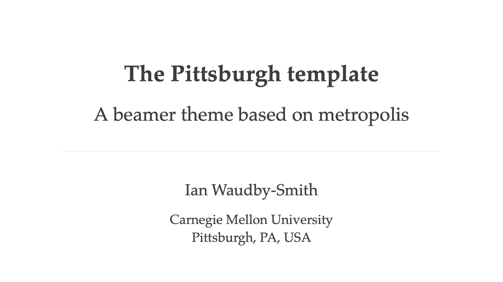
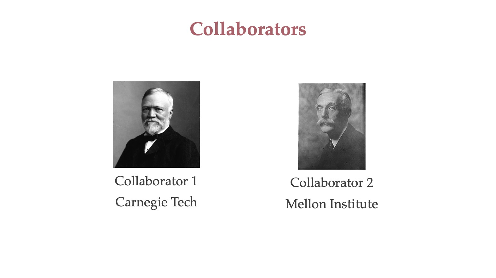
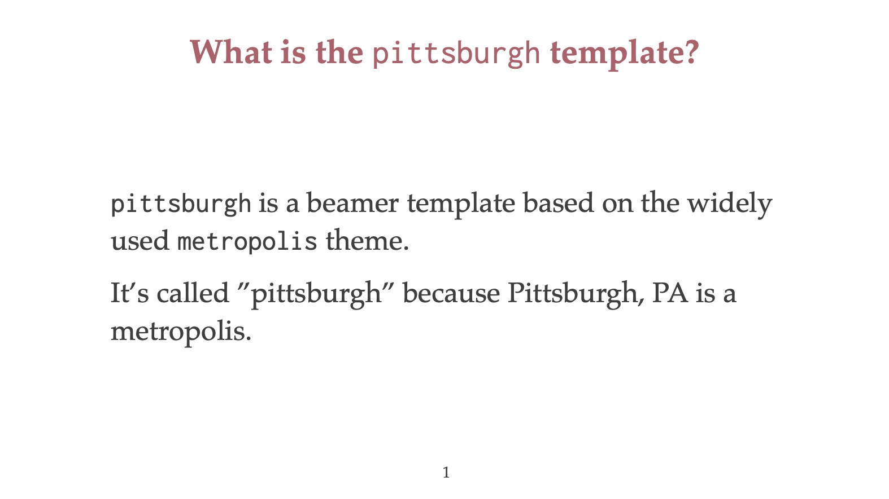
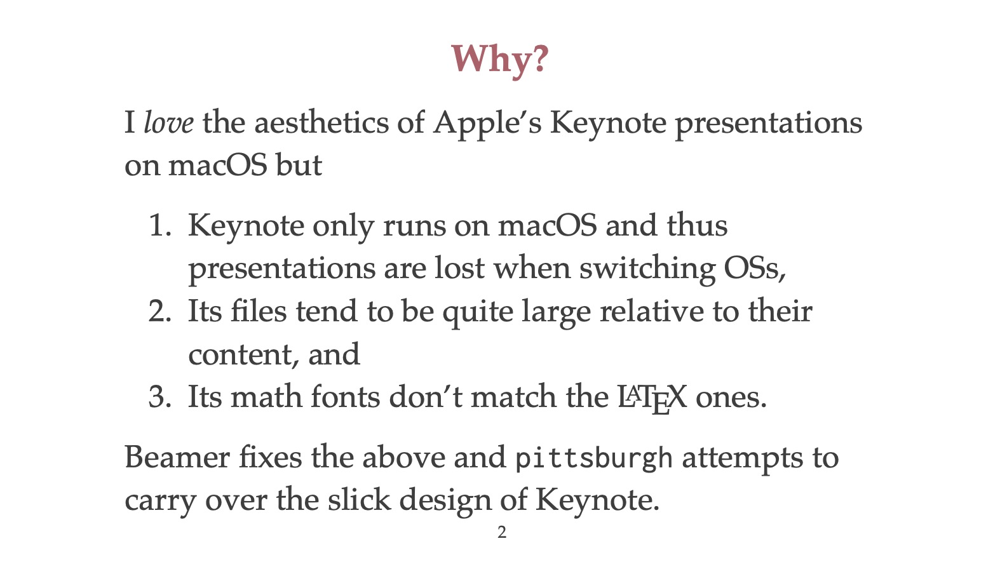
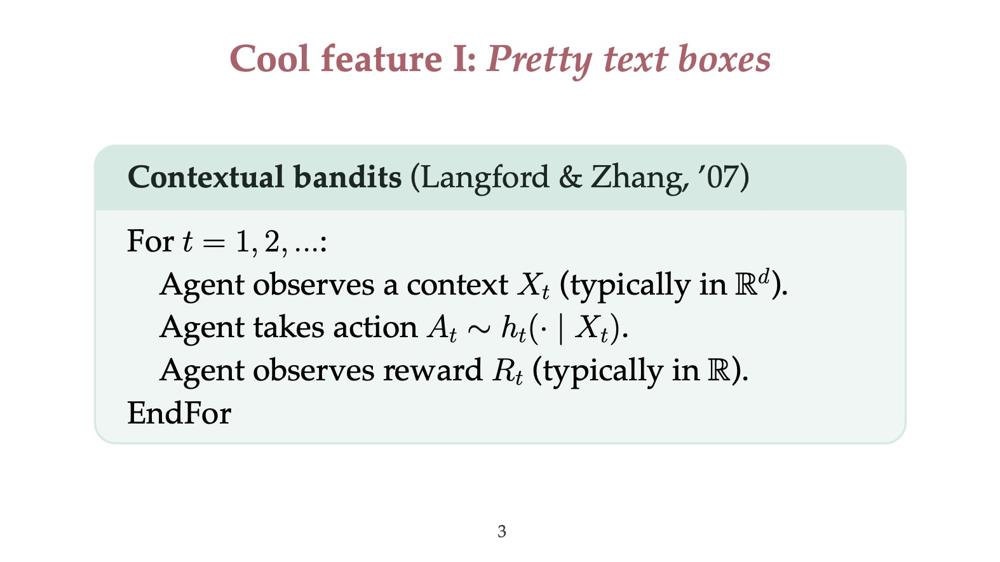
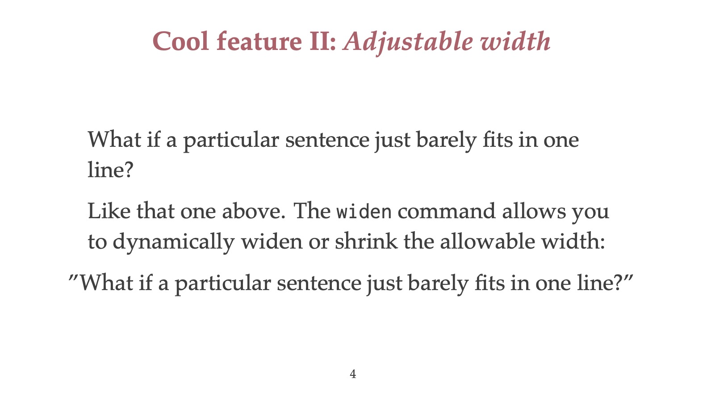

# Pittsburgh beamer theme

A beamer template based on the [metropolis](https://github.com/matze/mtheme) theme.

## Screenshots

## Caveats

1. This is just the template I use for presentations so it might have bugs or be annoying to customize.
2. I like to use [org-mode](https://orgmode.org/worg/exporters/beamer/tutorial.html) to make beamer presentations such as in [demo/demo_presentation.org](demo/demo_presentation.org) and thus the tex file in [demo/demo_presentation.tex](demo/demo_presentation.tex) may be messy by comparison (since it was auto-generated).

## License

Since it is heavily based on [metropolis](https://github.com/matze/mtheme), this theme is licensed under the [CC BY-SA 4.0 DEED](LICENSE).
